# R/MEASpikeR 

##### Version 1.0.0

##### Authors: Gaspard Martet, François-Xavier Lejeune, Carine Dalle

##### Contacts:
gaspard.martet@icm-institute.org
f-x.lejeune@icm-institute.org

##### Short description:
Performs Spike analysis

---

## Introduction

MEASpikeR is a library of R functions designed for spike analysis of in vitro microelectrode array (MEA) signal data. The package was coded in R v4.2.2 (R Development Core Team, 2022). It is directly compatible with MED64 recordings from single-well, 4 and 8 multi-wells probes, with each well consisting of multiple electrodes (64, 16 and 8 channels, respectively). 
Functions in MEASpikeR can be used for the filtering, exploratory analyses, and visualization of the MEA data. 

In this vignette, the use of the functions is explained and illustrated using the data from a study that aimed to determine the effect of TREK-1 openers on neuronal excitability. For this purpose, spike activity was recorded from primary neuronal culture (cortex, mice) using the multielectrode array technique. Electrophysiological recordings were performed at day in vitro (DIV) 15.

All input data are directly generated by the MEA recording system. Each recording consists of two files (one "frequency" file and one "spike" file) in .csv format. In addition, the use of MEASpikeR requires an additional guideline file in `.xlsx` format to launch analyses on multiple recordings with multiple experimental conditions.

## Quick start 

A quick introduction to MEASpikeR including download, installation and getting started. The user needs to download the directory of data files along with an R-type file containing ready-to-use commands for utilizing data analysis and visualization functions.

Here, the user simply needs to download:

*  the `\data` directory containing the data files and the guideline file [here](https://instituteicm-my.sharepoint.com/:f:/g/personal/gaspard_martet_icm-institute_org/Eo0m4uB8wWZBlXsDMaH96bYB55i_-LansmJY5tW7cgFk3Q?e=VFiAKw).

* an R file to open in RStudio that contains ready-to-use commands for subsequently using the various analysis functions of the package on the example data [here](https://instituteicm-my.sharepoint.com/personal/gaspard_martet_icm-institute_org/_layouts/15/onedrive.aspx?login_hint=gaspard%2Emartet%40icm%2Dinstitute%2Eorg&sw=auth&id=%2Fpersonal%2Fgaspard%5Fmartet%5Ficm%2Dinstitute%5Forg%2FDocuments%2FDocuments%2FMEA%2Fprocedure%5Fuse%5FMEASpikeR&view=0). For all details, you can access to the documentation of the functions in the Help window of Rtudio.

## How to install MEASpikeR from GitLab 

MEASpikeR is available at https://gitlab.com/icm-institute/dac/biostats/MEASpikeR. It can be installed as a regular R package. 

```{r include = TRUE, tidy = TRUE, eval = FALSE, highlight = TRUE}
# first step: install and load the "devtools" package from CRAN.
install.packages("devtools")
library(devtools)

# second step: install MEASpikeR using the install_gitlab() command 
devtools::install_gitlab("icm-institute/DAC/biostats/MEASpikeR", build_vignettes = TRUE)

# load MEASpikeR to get started
library(MEASpikeR)

```
After completing the installation, it is recommended to restart your R Studio session with the command `.rs.restartR()` to access the package.

## Step 1: Organise MEA data in a folder called `\data`

Data are generated automatically from recordings. **These files consist of “frequency” and “spike” `.csv` files that need to be stored in the same folder called “data” to be used by MEASpikeR.**

## Step 2: Fill in the guideline file

A guideline is required to perform customized and multiple analyses of a single recording file. The guideline is an excel file which contains the name of the recording file and the setting parameters to be chosen by the user. These parameters include, among others, the time window for analysis, the channels to keep (or exclude), etc. In the link below, you can download the blank template file of the guideline **to fill in for your own analyses**. it's the sheet called "guideline_void" in the "MEA_Spikes_ANA_R_guideline" file. This file contains also a dictionnary of all guideline parameters and an example filled-in guideline.


Click [here](https://instituteicm-my.sharepoint.com/:f:/g/personal/gaspard_martet_icm-institute_org/Eo0m4uB8wWZBlXsDMaH96bYB55i_-LansmJY5tW7cgFk3Q?e=VFiAKw) to download the example `\data` folder with a void guideline [here](https://instituteicm-my.sharepoint.com/:x:/g/personal/gaspard_martet_icm-institute_org/EQGEqp1VpVFNmHSCzpWDPjkBkk48kzqwPBPxYd95IRZ5pg?e=KaI6WV) to fill in.

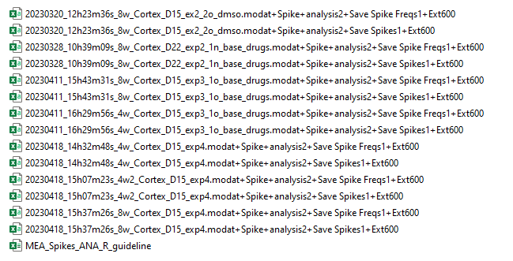

**The guideline has to be saved in the `\data` folder.**

**Note:** The example guideline is saved in a `.xlsx` file named "MEA_Spikes_ANA_R_guideline" by default. You can choose a different name for the guideline and specify it in the `guideline_filename` argument of the `dataset_filtering` function. 

## Step 3: Create a MEASpikeR object

### 1. dataset_filtering

The dataset_filtering function extracts information from guideline and `.csv` files in the data folder to create an R object of class 'MEASpikeR' containing filtered data. This function stores the usable data for the package's functions either as an R object (class 'MEASpikeR') or/and as a `.RData` file in the data folder. The default filename is 'MEA_DATAFILTERED.Rdata,' but users can specify a different name using the 'filename' function argument.

**This function must always be launched first to be able to use the other functions. If the guideline is modified, it must also be relaunched to update the MEASpikeR object.**

```{r, include = TRUE, tidy = TRUE, eval = FALSE, highlight = TRUE, results = "hide"}
# Put the path to the data file
data_path <- "C:/Users/prenom.nom/Desktop/MEA/data"

# Apply the function dataset_filtering
out.MEA <- MEASpikeR::dataset_filtering(
    data.path = data_path,
    guideline_filename = "MEA_Spikes_ANA_R_guideline",
    sheet_used = 1,
    MinFR = 0,
    spike.sorting = FALSE,
    min.spike = 10,
    validation.index = "silhouette",
    cutoff.index = 0.5,
    nb.electrode = 64,
    save.rDATA = TRUE,
    filename = "MEA_DATAFILTERED"
)

```

**Help:** For a detailed description of the function and its arguments, you can use the R command `?MEASpikeR::dataset_filtering` to access the documentation in the Help window of R Studio. Similarly, you can also access the help for other functions in the package using the same method. 

**Spike sorting:** In the arguments, it is still possible to activate a "spike sorting" feature (`spike.sorting=TRUE`) that allows grouping recordings from the same channel based on the signal’s waveform, and in certain cases, identifying artifact signals. The implemented approach for the spike sorting uses four components of the principal component analysis (PCA) of signals, along with a classification using the k-means method to identify potential clusters. To determine the number of clusters, the function uses several indices implemented in the R package NbClust (by default, the "silhouette" method). It is emphasized to the user that spike sorting is not the primary goal of the MEASpikeR package, and more sophisticated methods exist in other specialized softwares.

**Outputs:** The output object contains the filtered data for each condition (a data frame per condition). This step is carried out according to the “guideline”, allowing for customized data analysis. For example, by selecting recording time windows, excluding certain electrodes, or choosing only electrodes with sufficient signal (by specifying the `minFR` and/or `min.spike` arguments). All outputs (also including the guideline, and data summary tables) are stored in an object of class “MEASpikeR” and/or a `.RData` file (saved in the `\data` folder) that are generated to be used as inputs of the other functions of the package.

## Step 4 (optional): Create an output directory

In all the functions, results are saved in a directory which the path correponds to the `output_directory` argument. You can create a folder in which you want all your results are saved. But you can also save results in a current directory (like for example your Desktop or Documents) and that's why this step is optional. You'll just have to precise the path to the directory in which you want to save your results in the `output_directory` argument.

You can Run the code below to create it in your desktop with R or you can create it manually.

```{r, include = TRUE, tidy = TRUE, eval = FALSE, higlight = TRUE}
# Create an output directory
dir.create(path = "C:/Users/prenom.nom/Desktop/output_MEA")

```


## Step 5: Data visualisation functions

### 2. spike_waveform

This function is used to visualize overlapped spike waveform from each electrode. MEASpikeR allows for signal suppression, enabling the user to handle signal artefacts easily and efficiently and so for incomplete datasets to be analysed.

```{r, include = TRUE, tidy = TRUE, eval = FALSE, highlight = TRUE}
# The path to the Rdat file obtained by dataset_filtering
filt.data.path <- "C:/Users/prenom.nom/Desktop/MEA/data/MEA_DATAFILTERED.Rdat"

# The path to the output directory created before (or you current directory)
output_MEA <- "C:/Users/prenom.nom/Desktop/output_MEA"

# using the spike_waveform function with a MEASpikeR object in input
MEASpikeR::spike_waveform(
  object = out.MEA,
  filt.data.path = NA,
  output_directory = output_MEA,
  spike_col = "forestgreen",
  scale = "free",
  mean_trace = TRUE,
  col_mean_trace = "black",
  color_viridis = FALSE,
  format.save = "both"
)

# using the spike_waveform function with the Rdat file in input
MEASpikeR::spike_waveform(
  object = NA,
  filt.data.path = filt.data.path,
  output_directory = output_MEA,
  spike_col = "forestgreen",
  scale = "free",
  mean_trace = TRUE,
  col_mean_trace = "black",
  color_viridis = FALSE,
  format.save = "both"
)

```

The output of this function is a folder called **outfile_waveform_** with date and time as suffix and saved in the output directory you precised in `output_directory` argument. What it contains depends on what you have precised in `format.save` argument. If you have precised `several_pages`, It contains as many `.pdf` files as there are guideline conditions (in our example 26). If you have precised `one_page`, the folder contains as many `.png` files as there are conditions. And if you have precised `both` (by default) it saves simultaneously `.png` and `.pdf` files in the folder.

**Note that each file generated may take a minute to generate. The more conditions there are, the longer it will take to generate the folder.**

**WARNING :** the path of the output directory doesn't have to be too long because there is a limit number of character to save these files.

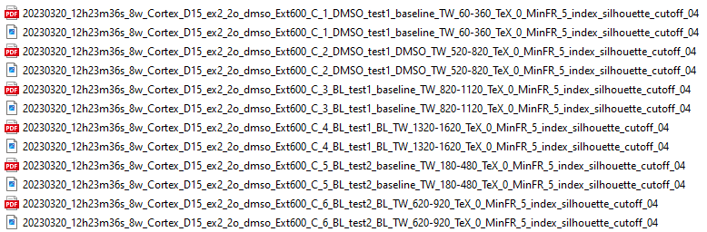

If we decide to open one of `.png` files, we can see the spikes for each electrods. a cross indicates a chanel excluded under guideline conditions. If there is a blank in one case, it means that there is not enough data to draw a spike.

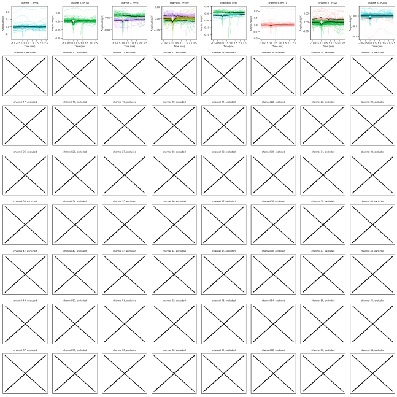

We can also open it in `.pdf` version:

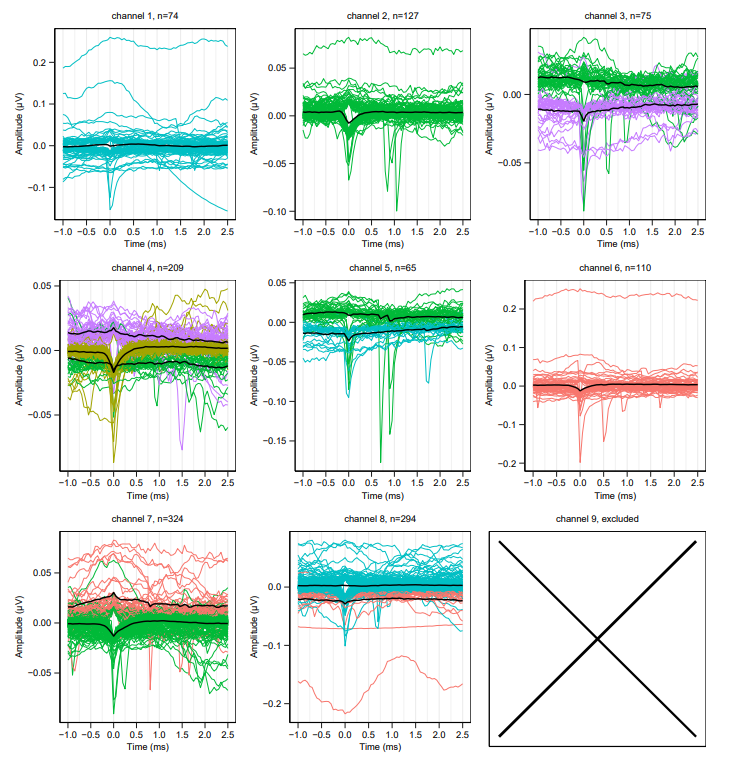


### 3. ISI

This function generates histogram of the inter-spike interval (ISI) which is the time between two sequential spikes. This histogram is draw for each electrode.

```{r, include = TRUE, tidy = TRUE, eval = FALSE, highlight = TRUE}
# Using the ISI function with the Rdat file as input
MEASpikeR::ISI(
  object = out.MEA,
  filt.data.path = NA,
  output_directory = output_MEA,
  col_hist = "darkgreen",
  bin.width = 50,
  interval.max = 300,
  format.save = "both"
)

# Using the ISI function with the Rdat file as input
MEASpikeR::ISI(
  object = NA,
  filt.data.path = filt.data.path,
  output_directory = output_MEA,
  col_hist = "darkgreen",
  bin.width = 50,
  interval.max = 300,
  format.save = "both"
)

```

The output of this function depends on what you have precised in 'format.save' argument. If you have precised "several_pages", the output is a folder called **ISIh_outfiles_** with date and time as suffix. It contains as many `.pdf` files as there are guideline conditions (in our example 26). If you have precised "one_page", the folder contains as many `.png` files as there are conditions. And if you precised "both" it saves simultaneously `.png` and `.pdf` files in the folder. The folder will be saved in the output directory you precised in `output_directory` argument.

if we decide to open one of the `.png` files, we can see the ISI histogram for each electrods. a cross indicates a chanel excluded under guideline conditions. If there is a blank in one case, it means that there is not enough data to draw an histogram.

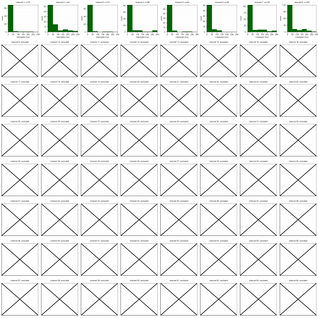

We can also open it in `.pdf` version:

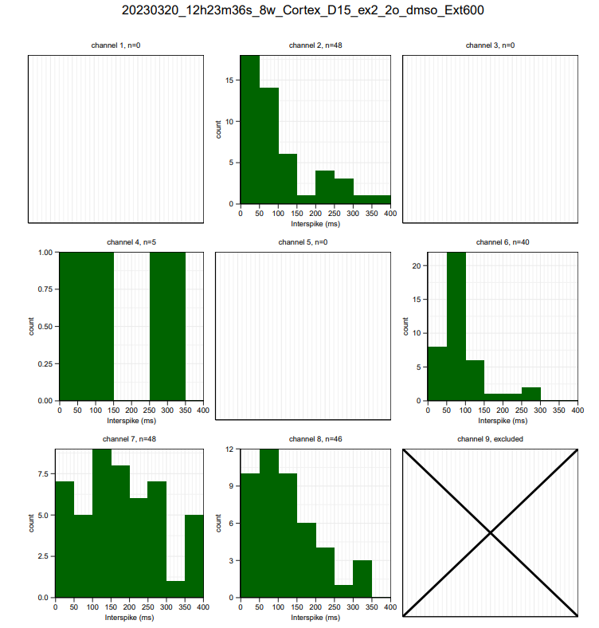

### 4. spikeraster_heatmap

This function gives two types of graphics: Spikerasters and heatmaps. The first one draw period of recording spikes for each electrode and include time window to delete. The second one provides heatmaps which represents the Spike activity of each electrode of the matrix.

```{r, include = TRUE, tidy = TRUE, eval = FALSE, highlight = TRUE, results = "hide"}
# Using the spikeraster_heatmap function with the MEASpikeR object as input
MEASpikeR::spikeraster_heatmap(
  object = out.MEA,
  filt.data.path = NA,
  output_directory = output_MEA,
  scale = "free",
  end_record_color = "red",
  spike_col = "black",
  add.burst = TRUE,
  burst.detection.method = "MI",
  max_ISI_start_burst = 170,
  max_ISI_end_burst = 300,
  min_IBI = 50,
  min_spike_in_burst = 5,
  min_burst_duration = 50,
  palette = "viridis2",
  col.cell.border = "gray85"
)

# Using the spikeraster_heatmap function with the Rdat file as input
MEASpikeR::spikeraster_heatmap(
  object = NA,
  filt.data.path = filt.data.path,
  output_directory = output_MEA,
  scale = "free",
  end_record_color = "red",
  spike_col = "black",
  add.burst = TRUE,
  burst.detection.method = "MI",
  max_ISI_start_burst = 170,
  max_ISI_end_burst = 300,
  min_IBI = 50,
  min_spike_in_burst = 5,
  min_burst_duration = 50,
  palette = "viridis2",
  col.cell.border = "gray85"
)

```

The output of this function is a `.pdf` file which contains a raster plot and a heatmap per condition. This file will be saved in the output directory you precised in the `output_directory` argument. There is a view of this `.pdf` file :

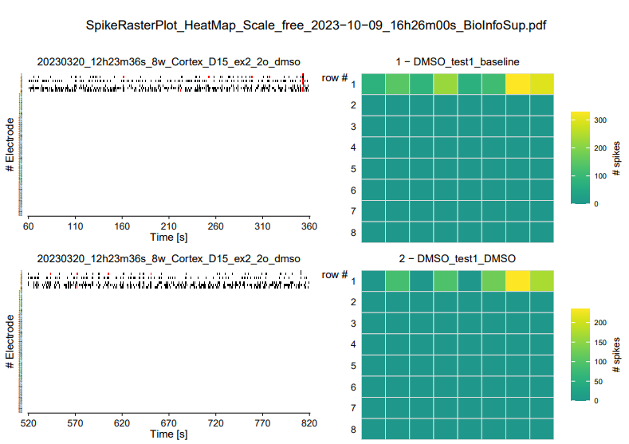

### 5. spike_rate_plot

This function can be used to see for each condition at which time spikes have the higher rate

```{r, include = TRUE, tidy = TRUE, eval = FALSE, highlight = TRUE, results = "hide"}
# Using the spike_rate_plot function with the MEASpikeR object as input
MEASpikeR::spike_rate_plot(
                     object = out.MEA,
                     filt.data.path = NA,
                     output_directory = output_MEA,
                     spike_col = "forestgreen",
                     plot = "line"
                     )

# Using the spike_rate_plot function with the Rdat file as input
MEASpikeR::spike_rate_plot(
                     object = NA,
                     filt.data.path = filt.data.path,
                     output_directory = output_MEA,
                     spike_col = "forestgreen",
                     plot = "line"
                     )

```

In output of this function, we obtain as many pictures as number of conditions in the guideline and for example, there is one example of spike detection rate graphic :

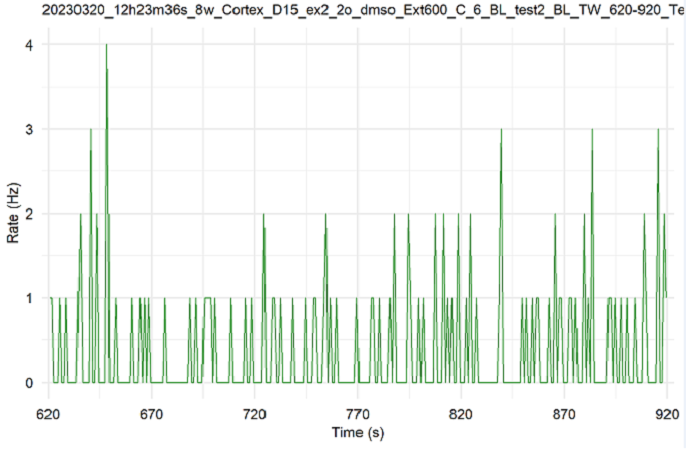

In addition, this function returns an excel file called "AWSDR" with date and time as suffix and contains as many sheets as there are conditions. Each sheet contains a table with two columns. The first column indicates time, and the second column indicates the firing rate.

These pictures and this excel file are saved in the output directory you have precised in the `output_directory` argument.

## Step 6: Quantitative data analyses functions

### 6. firing_rate

This function extracts the number of active electrodes and mean firing rate (MFR in Hz) at the well-level and those for each condition which are in the analytical guideline. 

```{r, include = TRUE, tidy = TRUE, eval = FALSE, highlight = TRUE}
# Using the firing_rate function with the MEASpikeR object as input
MEASpikeR::firing_rate(
  object = out.MEA,
  filt.data.path = NA,
  output_directory = output_MEA)

# Using the firing_rate function with the Rdat file as input
MEASpikeR::firing_rate(
  object = NA,
  filt.data.path = filt.data.path,
  output_directory = output_MEA)

```

The output of this function is this excel file which indicates the firing rate for each channel not excluded in a guideline condition. This excel file will be saved in the output directory you have precised in the `output_directory` argument.

#### Sheet 1: FiringRate

The first sheet called "FiringRate" indicates the firing rate for each channel not excluded in the guideline for each condition, there is an overview of the first sheet.

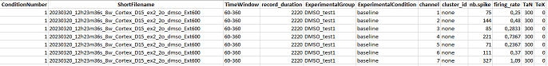

There is what each column means:

* **ConditionNumber** is the identifiant number of the guideline condition.
* **ShortFilename** is the name of the `.csv` file in the `\data` folder on which the analyses will be performed.
* **TimeWindow** is the time window (s) on which we will record spike activity.
* **record_duration** is the total record duration which contains the time window.
* **ExperimentalGroup** is the name of the experimental group which depends of `Experimentalondition`.
* **ExperimentalCondition** is the experimental condition (baseline, DMSO or DL).
* **channel** is the channel of interest.
* **cluster_id** is the identifiant number of the cluster if you decided to perform spike sorting.
* **nb.spike** is the number of spikes observed during the time window.
* **TaN** is the difference between the highest value and the lowest value of the time window. It's the time we keep for analysis.
* **TeX** is the time to exclude from the analysis.

#### Sheet 2: MFR

The second sheet called "MFR" is a summary of the firing rate for each conditions of the guideline. There is an overview of the second sheet:

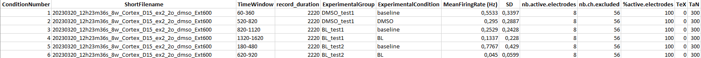

There is what each column means:

* **ConditionNumber** is the identifiant number of the condition.
* **ShortFilename** is the name of the `.csv` file in the `\data` folder on which the analyses will be performed.
* **TimeWindow** is the time window (s) on which we will record spike activity.
* **record_duration** is the total record duration which contains the time window.
* **ExperimentalGroup** is the name of the experimental group which depends of `Experimentalondition`.
* **ExperimentalCondition** is the experimental condition (baseline, DMSO or DL).
* **MeanFiringRate (Hz)** is the mean firing rate on the channels for each conditions.
* **SD** is the standard error of the firing rate on the channels for each conditions.
* **nb.active.electrodes** is the count of channels not excluded according to the condition.
* **nb.ch.excluded** is the count of channels excluded according to the condition.
* **%active.electrodes**
* **TeX** is the time to exclude from the analysis.
* **TaN** is the difference between the highest value and the lowest value of the time window.

#### sheet 3: guideline

It's the same as the guideline in the `\data` folder.

### 7. burst_detection

This function detects bursts which are short periods of time with elevated spike frequencies. Users can choose between two methods: the "Maximum Interval" (MI) ou Chen method (or log SI). It extracts several features per electrods such as burst durations, burst rates, IBI and number of spikes in a burst. 

```{r, include = TRUE, tidy = TRUE, eval = FALSE, highlight = TRUE, results = "hide"}
# Using the firing_rate function with the MEASpikeR object as input
MEASpikeR::burst_detection(
  object = out.MEA,
  filt.data.path = NA,
  output_directory = output_MEA,
  burst.detection.method = "MI",
  max_ISI_start_burst = 170,
  max_ISI_end_burst = 300,
  min_IBI = 50,
  min_spike_in_burst = 5,
  min_burst_duration = 50
)

# Using the firing_rate function with the Rdat file as input
MEASpikeR::burst_detection(
  object = NA,
  filt.data.path = filt.data.path,
  output_directory = output_MEA,
  burst.detection.method = "MI",
  max_ISI_start_burst = 170,
  max_ISI_end_burst = 300,
  min_IBI = 50,
  min_spike_in_burst = 5,
  min_burst_duration = 50
)

```

The output is an excel file which gives informations (burts duration, number of spikes in the burst, etc.) about bursts observed per channel not excluded in a guideline condition. The excel file is saved in the output directory you have precised in the `output_directory` argument.

#### Sheet 1: Burst

There is an overview of the first sheet called "Burst":

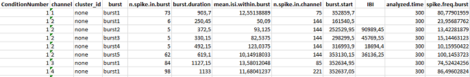

There is what each column means:

* **ConditionNumber** is the identifiant number of the guideline condition.
* **channel** is the channel of interest.
* **cluster_id** is the identifiant number of the cluster if you decided to perform spike sorting.
* **burst** is the identifiant number of the burst you have in the considered channel.
* **n.spike.in.burst** is the number of spikes in the considered burst.
* **burst_duration** is the duration of the burst observed.
* **mean.isi.within.burst** is the mean time of inter spike interval (ISI) within a burst.
* **n.spike.in.channel** is the number of spikes in the considered channel.
* **burst start**
* **IBI** is the inter burst interval (IBI) which is the time between two sequential bursts.
* **analyzed.time** is the difference between the highest value and the lowest value of the time window.
* **spike.freq.burst**

#### Sheet 2: Channel

There is an overview of the second sheet called "Channel" :

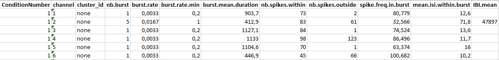

There is what each column means:

* **ConditionNumber** is the number of the guideline condition.
* **channel** is the channel of interest.
* **cluster_id** is the identifiant number of the cluster if you decided to perform spike sorting.
* **nb.burst** is the number of burst in the considered channel.
* **burst.rate**
* **burst.rate.min**
* **burst.mean.duration** is the burst mean duration.
* **nb.spikes.within** is the number of spikes inside the considered burst.
* **nb.spikes.outside** is the number of spikes registered in the considered channel.
* **spike.freq.in.burst**
* **mean.isi.within.burst** is the mean interspike duration for spikes which are in the burst.
* **IBI.mean** is the mean duration of an inter-burst interval per channel and per condition.

#### Sheet 3: Condition

This sheet is a summary of burst analysis for each condition.

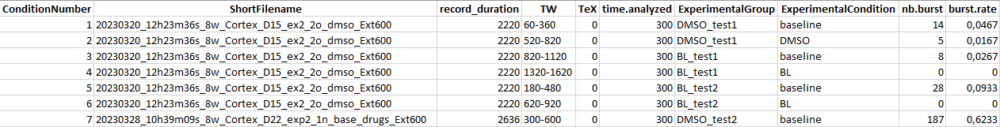

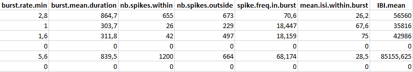

There is what each column means:

* **ConditionNumber** is the identifiant number of the guideline condition.
* **ShortFilename** is the name of the `.csv` file in the `\data` folder on which the analyses will be performed.
* **record_duration** is the record duration.
* **TW** is the time window of interest for burst analysis for each condition.
* **TeX** is the time to exclude from the analysis.
* **time.analyzed** is the difference between the highest value and the lowest value of TW.
* **ExperimentalCondition** is the experimental condition (baseline, DMSO or DL).
* **ExperimentalGroup** is the experimental group.
* **nb.burst** is the number of burst observed within each condition.
* **burst.rate** is the burst rate within each condition.
* **burst.rate.min**
* **burst.mean.duration** is the burst mean duration within each condition.
* **nb.spikes.within** is the sum of the number of spikes observed within each burst of each condition.
* **nb.spikes.outside** is the sum of the number of spikes observed outside each burst of each condition.
* **spike.freq.in.burst**
* **mean.isi.within.burst** is the mean duration of interspike interval of each spike within each burst of
each condition.
* **IBI.mean** is the mean duration of an inter-burst interval per channel and per condition.

#### Sheet 4: Guideline

It's the same as the guideline in the `\data` folder.

## References

Dalle C., Martet G., Kaddouri Y., Rebola N., Whitmarsh S., Lejeune FX.(2023). **_MEASpikeR_: a new package
for spike analysis and visualization of _in vitro_ MEA data**.

[Ref] R Core Team (2022). R: A language and environment for statistical computing. R Foundation for Statistical Computing, Vienna, Austria. URL https://www.R-project.org/.
