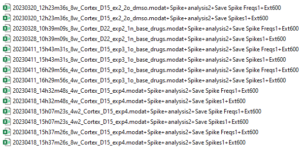
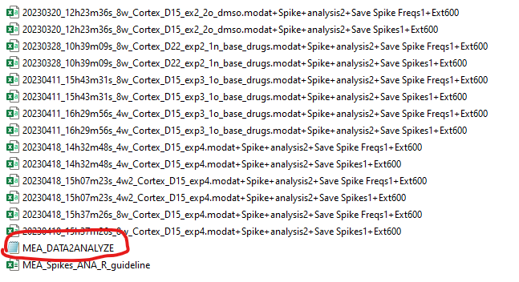

# R/MEASpikeR 

##### Version 1.0.0

##### Authors: Gaspard Martet, François-Xavier Lejeune, Carine Dalle

##### Contacts:
gaspard.martet@icm-institute.org
f-x.lejeune@icm-institute.org

##### Short description:
Performs Spike analysis

---

## Introduction

MEASpikeR is a library of R functions designed for spike analysis of in vitro data. The package was coded in R v4.2.2 (R Development Core Team, 2022). It is directly compatible with MED64 recordings from single-well, 4 and 8 multi-wells probes, with each well consisting of multiple electrodes (64, 16 and 8 channels, respectively). Functions in MEASpikeR can be used for the filtering, exploratory analyses and visualisation of the MEA data.

The aim of the present study was to determine the effect of TREK-1 openers on neuronal excitability. For this purpose, spike activity was recorded from primary neuronal culture (cortex, mice) using the multielectrode array (MEA) technique. Electrophysiological recordings were performed at DIV 15.

All input data are directly generated by the MEA recording system. Each recording consists of two files (one "frequency" file and one "spike" file) in `.csv` format. In addition, the use of MEASpikeR requires an additional guideline file in `.xlsx` format to launch analyses on multiple recordings with multiple experimental conditions. 

[Ref] R Core Team (2022). R: A language and environment for statistical computing. R Foundation for Statistical Computing, Vienna, Austria. URL https://www.R-project.org/.

## How to install and import the package 

MEASpikeR can be downloaded at https://github.com/ParisBrainInstitute/MEASpikeR. It can be installed as a regular R package. 

```{r include = TRUE, tidy = TRUE, eval = FALSE, highlight = TRUE}
## If the package is available on Cran you can install it and load it like that

# for installing the package
install.packages("MEASpikeR")  

# for loading the package
library(MEASpikeR)   

## If the package is available on github, you can install it and load it like that 

# for installing the devtools package necessary to install a package available on github
install.packages("devtools")

# for loading devtools package
library(devtools)

# for loading the MEASpikeR package
devtools::install_github("ParisBrainInstitute/MEASpikeR")

```

## Step 1 Organise data in a folder called `\data`

Data are generated automatically from recordings. **There are two types of data files: spike files and frequence files and these two types of file must be present in the folder.** All datasets should be stored in a folder called "data" and should be saved in `.csv` format. This is a view of the `\data` folder without the guideline (we will explain how to create it in the next paragraph):



## Step 2: Create the guideline file

A guideline is also required to perform customized and multiple analyses of a single recording file. The guideline is an excel file which contains the  name of the recording file and some parameters to change, like for example, which channel to exclude or the time window which is interesting for analyses. We'll give an example of a white guideline file that **you'll have to fill in yourself.** 

```{r include = TRUE, tidy = TRUE, eval = FALSE, highlight = TRUE}
# Number of conditions, for example here we want 5 conditions
nb.condition <- 5

# To create the matrix with the twelve parameters we can play on.
guideline <- matrix(rep(NA, nb.condition*12), nrow = nb.condition, ncol = 12)

# Naming matrix columns
colnames(guideline) <- c("ConditionNumber", # The number of the condition
                         "Filename_spike", # The name of the spike csv file
                         "Filename_freq", # The name of the freq csv file
                         "removeChannel", # The identifier number of the channel (electrode) to remove
                         "TimeLimitStart", # The time which indicates the beginning of the time window
                         "TimeLimitEnd", # The time which indicates the end of the time window
                         "TimeToExclude", # The time window to exlude for analyses
                         "ExperimentalGroup", # The name of experimental group 
                         "ExperimentalCondition", # The name of the drug
                         "ExperimentalComment", # any comments
                         "InformationFolderName",
                         "AnalysisComment")

# Turning the matrix into dataset
guideline <- as.data.frame(guideline)


```

If you want to fill in this guideline in excel, you can run the code above and save this empty table with the function `write_xlsx` from the `writexl` package. You'll be able to fill in this guideline table directly in excel.

```{r, include = TRUE, tidy = TRUE, eval = FALSE, highlight = TRUE}
# Install and import the "writexl" package

install.packages("writexl")
library(writexl)

# Specify the path of the Excel file where you want to save the guideline
guideline_path <- "MEA_Spikes_ANA_R_guideline.xlsx"

# Save the guideline in excel format
write_xlsx(guideline, path = guideline_path)

```

**The guideline has to be saved in the `\data` folder.** This is a view of the `\data` folder:


## Step 3 : Create a MEASpikeR object

The `dataset_filtering` function extracts essential information from the guideline to create new filtered datas from `.csv` files in "data" folder. These new data will be saved in an object of class `MEASpikeR`, and if you like, in a `.Rdat` file and these data will be used for analyses. This function is always the first one to use among the seven functions. **If you modify the guideline, you have to rerun this function.** It operates as follow :

```{r, include = TRUE, tidy = TRUE, eval = FALSE, highlight = TRUE, results = "hide"}
# Put the path to the data file
data_path <- "C:/Users/gaspard.martet/OneDrive - ICM/Documents/MEA/data_v1/data"

# Apply the function dataset_filtering
out.MEA <- MEASpikeR::dataset_filtering(
    data.path = data_path, 
    guideline_name_file = "MEA_Spikes_ANA_R_guideline",
    sheet_used = 1,
    MinFR = 0,
    spike.sorting = FALSE,
    min.spike = 10,
    validation.index = "silhouette",
    cutoff.index = 0.5,
    nb.electrode = 64,
    save.rDATA = TRUE,
    filename = "MEA_DATA2ANALYZE"
)

```

If you want to know what the parameters correspond to, you can run `?MEASpikeR::dataset_filtering` and you will have access to the documentation of the function in the "Help" tab of the grap interface of Rstudio. Generally, you can do it with every function of the package, not only `dataset_filtering`. Spike sorting is a clustering of spike according to their shape, we can decide to do it or not. 

In output, the function converts all the input data into an object of class MEASpikeR which contains the filtered data of each condition. **The same object of class MEASpikeR will be used as input to all the other functions of the package.**

Once this step executed, an Rdat file is saved in the `data_path` folder if you precised `save.Rdata = TRUE` in `dataset_filtering`. This Rdat file can be used as input of all other functions too:



## Step 4: Data visualisation functions

### spike_waveform

This function is used to visualize overlapped spike waveform from each electrode. MEASpikeR allows for signal suppression, enabling the user to handle signal artefacts easily and efficiently and so for incomplete datasets to be analysed. This function operates as follow : 

```{r, include = TRUE, tidy = TRUE, eval = FALSE, highlight = TRUE}
# The path to the Rdat file obtained by dataset_filtering
filt.data.path <- "C:/Users/Documents/MEA/data/MEA_DATA2ANALYZE.Rdat"

# using the spike_waveform function with a MEASpikeR object in input
MEASpikeR::spike_waveform(
  object = out.MEA,
  filt.data.path = NA,
  output_directory = NA,
  spike_col = "forestgreen",
  scale = "free",
  mean_trace = TRUE,
  col_mean_trace = "black",
  color_viridis = FALSE,
  format.save = "both"
)

# using the spike_waveform function with the Rdat file in input
MEASpikeR::spike_waveform(
  object = NA,
  filt.data.path = filt.data.path,
  output_directory = NA,
  spike_col = "forestgreen",
  scale = "free",
  mean_trace = TRUE,
  col_mean_trace = "black",
  color_viridis = FALSE,
  format.save = "both"
)

```

The output of this function is a folder called **outfile_waveform_** with date and time as prefix and saved in the output directory you precised in `output_directory` argument. What it contains depends on what you have precised in `format.save` argument. If you precised `several_pages`, It contains as many pdf files as there are guideline conditions (in our example 26). If you precised `one_page`, the folder will contain as many png files as there are conditions. And if you precised `both` (by default) it will save simultaneously "png" and "pdf" files in the folder.

**Note that each file generated may take a minute to generate. The more conditions there are, the longer it will take to generate the folder.** 

**WARNING :** the path of the output directory doesn't have to be too long because there is a limit number of character to save these files.


If we decide to open one of png files, we can see the spikes for each electrods. a cross indicates a chanel excluded under guideline conditions. If there is a blank in one case, it means that there is not enough data to draw a spike. 


We can also open it in pdf version:


### ISI 

This function generates histogram of the inter-spike interval (ISI) which is the time between two sequential spikes. This histogram is draw for each electrode. This function operates as follow :

```{r, include = TRUE, tidy = TRUE, eval = FALSE, highlight = TRUE}
# Using the ISI function with the Rdat file as input
MEASpikeR::ISI(
  object = out.MEA,
  filt.data.path = NA, 
  output_directory = NA,
  col_hist = "darkgreen", 
  bin.width = 50, 
  interval.max = 300,
  format.save = "both"
)

# Using the ISI function with the Rdat file as input
MEASpikeR::ISI(
  object = NA,
  filt.data.path = filt.data.path, 
  output_directory = NA,
  col_hist = "darkgreen", 
  bin.width = 50, 
  interval.max = 300,
  format.save = "both"
)

```

The output of this function depends on what you have precised in 'format.save' argument. If you precised "several_pages", the output is a folder called **ISIh_outfiles_** with date and time as prefix. It contains as many pdf files as there are guideline conditions (in our example 26). If you precised "one_page", the folder will contain as many png files as there are conditions. And if you precised "both" it will save simultaneously "png" and "pdf" files in the folder. The folder will be saved in the output directory you precised in `output_directory` argument.

If we decide to open one of png files, we can see the ISI histogram for each electrods. a cross indicates a chanel excluded under guideline conditions. If there is a blank in one case, it means that there is not enough data to draw an histogram. 


We can also open it in pdf version:


### spikeraster_heatmap

This function gives two types of graphics: Spikerasters and heatmaps. The first one draw period af recording spikes for each electrode and include time window to delete. The second one provides heatmaps which represents the Spike activity of each electrod of the matrix. This function operates as follow : 

```{r, include = TRUE, tidy = TRUE, eval = FALSE, highlight = TRUE, results = "hide"}
# Using the spikeraster_heatmap function with the MEASpikeR object as input
MEASpikeR::spikeraster_heatmap(
  object = out.MEA,
  filt.data.path = NA,
  output_directory = NA,
  scale = "free",
  end_record_color = "red",
  spike_col = "black",
  add.burst = TRUE,
  burst.detection.method = "MI",
  max_ISI_start_burst = 170,
  max_ISI_end_burst = 300,
  min_IBI = 50,
  min_spike_in_burst = 5,
  min_burst_duration = 50,
  mypal = "viridis2",
  col.cell.border = "gray85"
)

# Using the spikeraster_heatmap function with the Rdat file as input
MEASpikeR::spikeraster_heatmap(
  object = NA,
  filt.data.path = filt.data.path,
  output_directory = NA,
  scale = "free",
  end_record_color = "red",
  spike_col = "black",
  add.burst = TRUE,
  burst.detection.method = "MI",
  max_ISI_start_burst = 170,
  max_ISI_end_burst = 300,
  min_IBI = 50,
  min_spike_in_burst = 5,
  min_burst_duration = 50,
  mypal = "viridis2",
  col.cell.border = "gray85"
)

```

The output of this function is a pdf file which contains a raster plot and a heatmap per condition. This file will be saved in the output directory you precised in the `output_directory` argument. There is a view of this pdf file : 


### spike_detection_rate

This function can be used to see for each condition at which time spikes have the higher rate 

```{r, include = TRUE, tidy = TRUE, eval = FALSE, highlight = TRUE, results = "hide"}
# Using the spike_detection_rate function with the MEASpikeR object as input
MEASpikeR::spike_detection_rate(
                     object = out.MEA,
                     filt.data.path = NA, 
                     output_directory = NA,
                     spike_col = "forestgreen", 
                     plot = "line"
                     )

# Using the spike_detection_rate function with the Rdat file as input
MEASpikeR::spike_detection_rate(
                     object = NA,
                     filt.data.path = filt.data.path, 
                     output_directory = NA,
                     spike_col = "forestgreen", 
                     plot = "line"
                     )

```

In output of this function, we obtain as many pictures as number of conditions in the guideline and for example, there is one example of spike detection rate graphic : 


These pictures are saved in the output directory you have precised in the `output_directory` argument.

## Step 5: Quantitative data analyses functions

### firing_rate

This function extracts the number of active electrodes and mean firing rate (MFR in Hz) at the well-level and those for each condition which are in the analytical guideline. This function operates as follow :

```{r, include = TRUE, tidy = TRUE, eval = FALSE, highlight = TRUE}
# Using the firing_rate function with the MEASpikeR object as input
MEASpikeR::firing_rate(
  object = out.MEA,
  filt.data.path = NA,
  output_directory = NA)

# Using the firing_rate function with the Rdat file as input
MEASpikeR::firing_rate(
  object = NA,
  filt.data.path = filt.data.path,
  output_directory = NA)

```

The output of this function is this excel file which indicates the firing rate for each channel not excluded in a guideline condition. This excel file will be saved in the output directory you have precised in the `output_directory` argument.

#### Sheet 1: FiringRate

The first sheet called "FiringRate" indicates the firing rate for each channel not excluded in the guideline for each condition, there is an overview of the first sheet.


There is what each column means:

* **ConditionNumber** is the number of the condition.
* **ShortFilename** is the name of the excel file on which the analyses will be performed.
* **TimeWindow** is the time window (s) on which we will record spike activity.
* **record_duration**
* **ExperimentalGroup** is the experimental group.
* **ExperimentalCondition** is the experimental condition (baseline, DMSO or DL).
* **channel** is the channel of interest.
* **cluster_id** is the ID of the cluster if you decided to perform spike sorting.
* **nb.spike** is the number of spikes observed during the time window.
* **TaN** is the difference between the highest value and the lowest value of the time window.
* **TeX**

#### Sheet 2: MFR

The second sheet called "MFR" is a summary of the firing rate for each conditions of the guideline. There is an overview of the second sheet:


There is what each column means:

* **ConditionNumber** is the number of the condition.
* **ShortFilename** is the name of the excel file on which the analyses will be performed.
* **TimeWindow** is the time window (s) on which we will record spike activity.
* **record_duration**
* **ExperimentalGroup** is the experimental group.
* **ExperimentalCondition** is the experimental condition (baseline, DMSO or DL).
* **MeanFiringRate (Hz)** is the mean firing rate on the channels for each conditions.
* **SD** is the standard error of the firing rate on the channels for each conditions.
* **nb.active.electrodes** is the count of channels not excluded according to the condition.
* **nb.ch.excluded** is the count of channels excluded according to the condition.
* **%active.electrodes**
* **TeX**
* **TaN** is the difference between the highest value and the lowest value of the time window.

#### sheet 3: guideline

It's the same as the guideline in the `\data` folder.

### burst_detection

This function detects bursts which are short periods of time with elevated spike frequencies. Users can choose between two methods: the "Maximum Interval" (MI) ou Chen method (or log SI). It extracts several features per electrods such as burst durations, burst rates, IBI and number of spikes in a burst. It operates as follow: 

```{r, include = TRUE, tidy = TRUE, eval = FALSE, highlight = TRUE, results = "hide"}
# Using the firing_rate function with the MEASpikeR object as input
MEASpikeR::burst_detection(
  object = out.MEA,
  filt.data.path = NA,
  output_directory = NA,
  burst.detection.method = "MI",
  max_ISI_start_burst = 170,
  max_ISI_end_burst = 300,
  min_IBI = 50,
  min_spike_in_burst = 5,
  min_burst_duration = 50
)

# Using the firing_rate function with the Rdat file as input
MEASpikeR::burst_detection(
  object = NA,
  filt.data.path = filt.data.path,
  output_directory = NA,
  burst.detection.method = "MI",
  max_ISI_start_burst = 170,
  max_ISI_end_burst = 300,
  min_IBI = 50,
  min_spike_in_burst = 5,
  min_burst_duration = 50
)

```

#### Sheet 1: Burst

There is an overview of the first sheet called "Burst":

The output is an excel file which gives informations (burts duration, number of spikes in the burst, etc.) about bursts observed per channel not excluded in a guideline condition. The excel file is saved in the output directory you have precised in the `output_directory` argument.


There is what each column means:

* **ConditionNumber** is the number of the condition.
* **channel** is the channel of interest.
* **cluster_id** is the ID of the cluster if you decided to perform spike sorting.
* **burst** is the identifiant number of the burst you have in the considered channel.
* **n.spike.in.burst** is the number of spikes in the considered burst.
* **burst_duration** is the burst time.
* **mean.isi.within.burst** is the mean time of inter spike interval (ISI).
* **n.spike.in.channel** is the number of spikes in the considered channel.
* **burst start**
* **IBI**
* **analyzed.time** is the difference between the highest value and the lowest value of the time window.
* **spike.freq.burst**

#### Sheet 2: Channel

There is an overview of the second sheet called "Channel" :


There is what each column means:

* **ConditionNumber** is the number of the condition.
* **channel** is the channel of interest.
* **cluster_id** is the ID of the cluster if you decided to perform spike sorting.
* **nb.burst** is the number of burst in the considered channel.
* **burst.rate**
* **burst.rate.min**
* **burst.mean.duration** is the burst mean duration.
* **nb.spikes.within** is the number of spikes inside the considered burst.
* **nb.spikes.outside** is the number of spikes registered in the considered channel.
* **spike.freq.in.burst**
* **mean.isi.within.burst** is the mean interspike duration for spikes which are in the burst.
* **IBI.mean**

#### Sheet 3: Condition

This sheet is a summary of burst analysis for each condition.


#### Sheet 4: Guideline

It's the same as the guideline in the `\data` folder.

## References

Dalle C., Martet G., Kaddouri Y., Rebola N., Whitmarsh S., Lejeune FX.(2023). **_MEASpikeR_: a new package
for spike analysis and visualization of _in vitro_ MEA data**.
